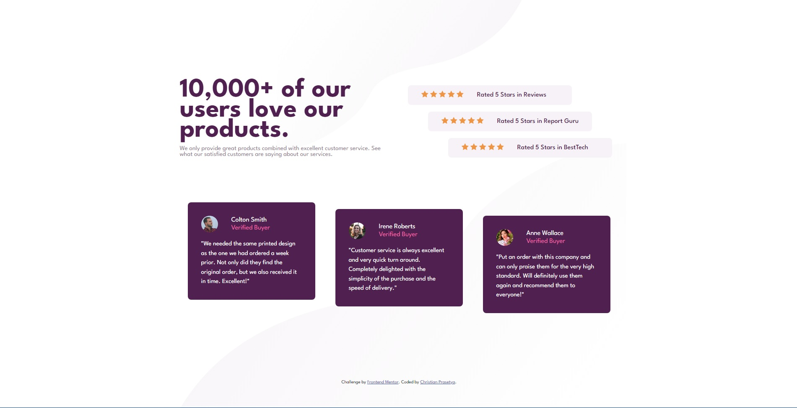
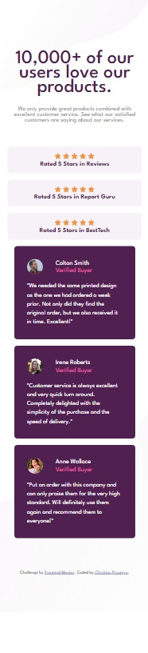

# Frontend Mentor - Social proof section solution

This is a solution to the [Social proof section challenge on Frontend Mentor](https://www.frontendmentor.io/challenges/social-proof-section-6e0qTv_bA). Frontend Mentor challenges help you improve your coding skills by building realistic projects.

## Table of contents

- [Overview](#overview)
  - [Screenshot](#screenshot)
  - [Links](#links)
- [My process](#my-process)
  - [Built with](#built-with)
  - [What I learned](#what-i-learned)
- [Author](#author)

## Overview

### Screenshot

### Links

- Solution URL: [Add solution URL here](https://your-solution-url.com)
- Live Site URL: [Add live site URL here](https://your-live-site-url.com)

## My process

### Built with

- Semantic HTML5 markup
- CSS custom properties
- Flexbox
- Mobile-first workflow

### What I learned

While working this challenge, I realize about the basic CSS and advanced positioning like Flex Box and Grid is really handy, and need to be excercised overtime.

It's not easy though, it requires logic and thinking when working with layouting the page with CSS.

### Continued development

Things to improve in the future is more excercised CSS layouting with display property, Flex Box, and even Grid.

## Author

- Instagram - [Christian Prasetya](https://www.instagram.com/cprasetya28)
- Frontend Mentor - [@christian-prasetya](https://www.frontendmentor.io/profile/christian-prasetya)
- GitHub - [@christian-prasetya](https://www.github.com/christian-prasetya)
